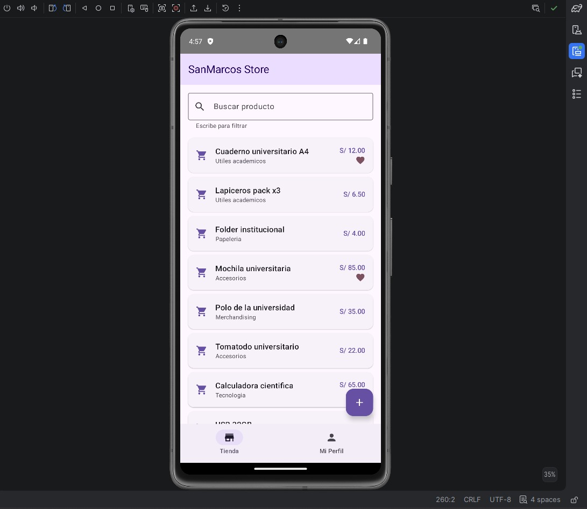
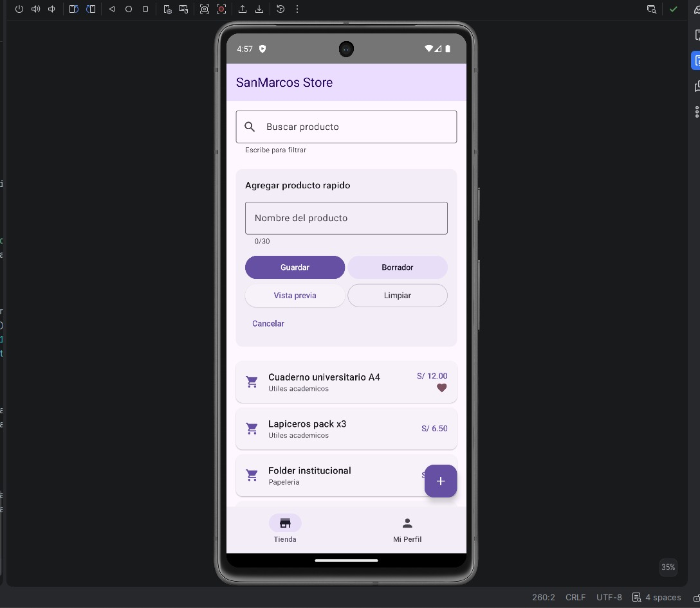
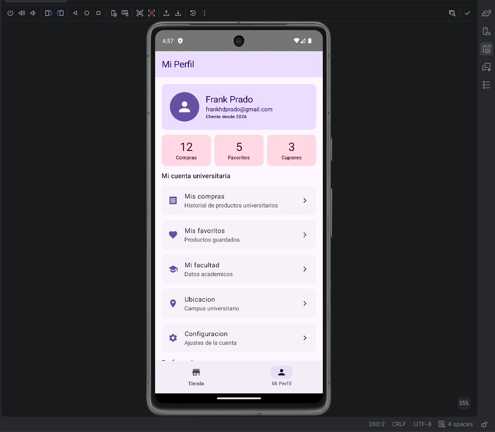
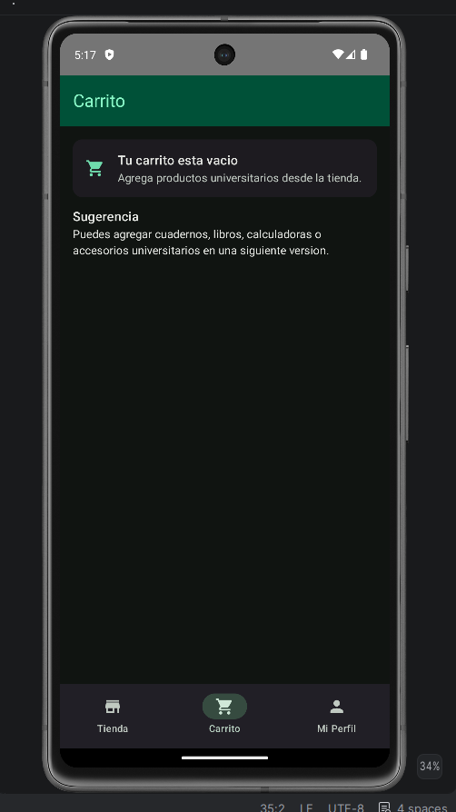
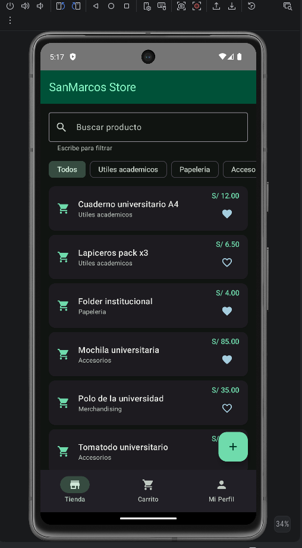
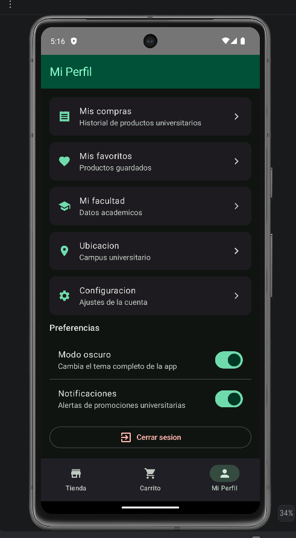
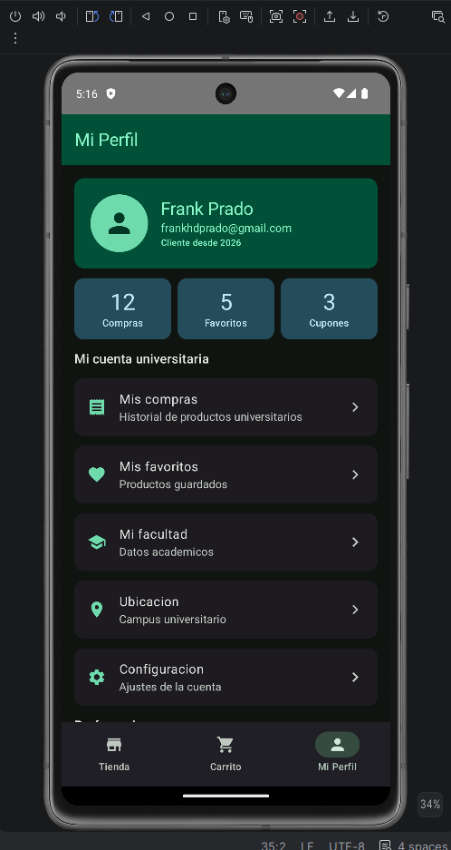

# SanMarcosStore - Lab 03

Aplicación Android desarrollada con Kotlin, Jetpack Compose y Material Design 3.

## Datos del estudiante

- Nombre: Frank Prado
- Correo: frankhdprado@gmail.com
- Laboratorio: Lab 03
- Emulador: Pixel 7 API 34

## Descripción breve

SanMarcosStore es una tienda universitaria móvil que muestra productos académicos, permite buscar y filtrar por categorías, marcar favoritos, ver detalle de productos, usar modo oscuro y navegar entre Tienda, Carrito y Perfil.

## Tecnologías utilizadas

- Kotlin
- Jetpack Compose
- Material Design 3
- Navigation Compose
- DataStore Preferences
- Android Studio

## Ejercicios completados

### Nivel 1: Personalización

- Se cambió el color principal del tema a una paleta verde universitaria.
- Se personalizó el perfil con los datos reales del estudiante.

### Nivel 2: Funcionalidad

- Se agregó el tercer tab Carrito.
- Se implementó favorito clickable en los productos.
- Se agregaron filtros por categoría usando FilterChip.

### Nivel 3: Avanzado

- Se agregó pantalla de detalle al hacer click en un producto.
- Se implementó modo oscuro real desde el perfil.
- Se persistieron los favoritos usando DataStore.

## Capturas de pantalla

### Pantalla Tienda con productos visibles

### Pantalla Tienda con formulario abierto

### Pantalla Mi Perfil completa

### Carrito

### Favoritos guardados

### Modo oscuro en Tienda

### Perfil en modo oscuro

## Estado del proyecto

Proyecto terminado y listo para entrega.